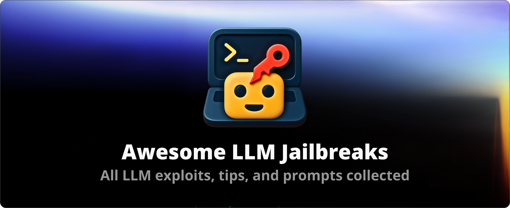

# Awesome LLM Jailbreaks

<!-- SHIELD GROUP -->

  
  
  
  
  
  
  

A curated collection of LLM jailbreaks, prompt injections, AI hacks, and vulnerabilities — the ultimate resource for exploring and understanding AI security risks.

## Table of Contents
- [Overview](#overview)
- [Why This Repository Matters](#why-this-repository-matters)
- [Core Concepts](#core-concepts)
    - [What is LLM Jailbreaking?](#what-is-llm-jailbreaking)
    - [What is Prompt Injection?](#what-is-prompt-injection)
    - [AI Hacking and Exploits Explained](#ai-hacking-and-exploits-explained)
    - [Understanding LLM Security Risks](#understanding-llm-security-risks)
- [Vulnerability Categories](#vulnerability-categories)
    - [1. Prompt Injection](#1-prompt-injection)
        - [Techniques & Methods](#techniques--methods)
        - [Safe Demonstrations](#safe-demonstrations)
        - [Known Vulnerabilities](#known-vulnerabilities)
    - [2. Sensitive Information Disclosure](#2-sensitive-information-disclosure)
        - [Types of Data Leaks](#types-of-data-leaks)
        - [Detection & Testing](#detection--testing)
        - [Real-World Examples](#real-world-examples)
    - [3. Supply Chain Vulnerabilities](#3-supply-chain-vulnerabilities)
        - [Plugins, APIs & External Dependencies](#plugins-apis--external-dependencies)
        - [Exploitation Techniques](#exploitation-techniques)
        - [Mitigation Strategies](#mitigation-strategies)
    - [4. Data & Model Poisoning](#4-data--model-poisoning)
        - [Attack Vectors](#attack-vectors)
        - [Safe Simulation](#safe-simulation)
        - [Case Studies](#case-studies)
    - [5. Improper Output Handling](#5-improper-output-handling)
        - [Generation Flaws](#generation-flaws)
        - [Exploitation Examples](#exploitation-examples)
    - [6. Excessive Agency](#6-excessive-agency)
        - [Overpowered Actions](#overpowered-actions)
        - [Demonstrations](#demonstrations)
    - [7. System Prompt Leakage](#7-system-prompt-leakage)
        - [Hidden Prompt Extraction](#hidden-prompt-extraction)
        - [Examples & Testing](#examples--testing)
    - [8. Vector & Embedding Weaknesses](#8-vector--embedding-weaknesses)
        - [Embedding Exploits](#embedding-exploits)
        - [Sandbox Testing](#sandbox-testing)
    - [9. Misinformation & Malicious Content](#9-misinformation--malicious-content)
        - [Prompt Engineering for False Output](#prompt-engineering-for-false-output)
        - [Safe Experiments](#safe-experiments)
    - [10. Unbounded Consumption](#10-unbounded-consumption)
        - [Resource Exhaustion Attacks](#resource-exhaustion-attacks)
        - [Monitoring & Prevention](#monitoring--prevention)
- [How-To Guides](#how-to-guides)
    - [Step-By-Step Jailbreaking](#step-by-step-jailbreaking)
    - [Safe Prompt Injection Testing](#safe-prompt-injection-testing)
    - [Exploiting AI Hacks Safely](#exploiting-ai-hacks-safely)
    - [Security Research Best Practices](#security-research-best-practices)
- [Curated Collection of Exploits & Prompts](#curated-collection-of-exploits--prompts)
    - [Prompt Injection Examples](#prompt-injection-examples)
    - [Jailbroken Prompts](#jailbroken-prompts)
    - [Vulnerability Demos](#vulnerability-demos)
- [Contributing](#contributing)
    - [Adding New Vulnerabilities](#adding-new-vulnerabilities)
    - [Responsible Disclosure](#responsible-disclosure)
- [Resources & References](#resources--references)
    - [Research Papers](#research-papers)
    - [Security Blogs & Talks](#security-blogs--talks)
    - [Open Source Tools](#open-source-tools)
- [Security & Ethics](#security--ethics)
- [FAQ](#faq)
- [License](#license)

---

## Overview
This repository is a **comprehensive blackhat-style resource** for exploring LLM jailbreaks, prompt injections, AI hacks, and vulnerabilities. Designed for **researchers, developers, and ethical hackers**, it provides a safe, structured, and reproducible framework to study AI security risks.

---

## Why This Repository Matters
- Centralized, categorized collection of AI security exploits.
- Developer-friendly and reproducible examples.
- Covers latest LLM vulnerabilities, prompt injections, and AI hacks.
- Educational and research-focused, promoting safe experimentation.

---

## Core Concepts

### What is LLM Jailbreaking?
> LLM Jailbreaking refers to techniques that bypass AI model restrictions, filters, or content policies to make the model produce unintended outputs.

### What is Prompt Injection?
> Prompt Injection is a method of tricking an AI into performing malicious or unintended instructions by crafting inputs that override the original instructions.

### AI Hacking and Exploits Explained
> Techniques and strategies used to find vulnerabilities in AI systems, including model manipulation, data poisoning, and exploitation of internal behaviors.

### Understanding LLM Security Risks
> Highlights the real-world consequences of AI vulnerabilities, such as sensitive data leaks, malicious outputs, or automated exploitation in applications.

---

## Vulnerability Categories

### 1. Prompt Injection
**Definition:** Tricks AI into executing unintended instructions.  
**Safe Demonstration Table:**
| Name | Description | Models | Risk Level |
|------|-------------|--------|-----------|
| Example PI 1 | Overrides instructions to bypass filter | GPT-4 | High |
| Example PI 2 | Forces AI to reveal hidden info | GPT-3 | Medium |

**Subsections:**
- Techniques & Methods  
- Safe Demonstrations  
- References & Further Reading  

---

### 2. Sensitive Information Disclosure
**Definition:** Leaks of secrets or data unintentionally.  
| Name | Data Type | Model | Risk Level |
|------|----------|-------|-----------|
| Leak Example 1 | API Keys | GPT-4 | High |
| Leak Example 2 | Internal prompts | GPT-3 | Medium |

Subsections:
- Types of Data Leaks  
- Detection & Testing  
- Real-World Examples  

---

### 3. Supply Chain Vulnerabilities
**Definition:** Exploits via plugins, APIs, datasets, or external dependencies.  
| Name | Component | Impact | Risk |
|------|-----------|--------|------|
| SupplyChainExploit1 | Plugin Injection | Data Tampering | High |

Subsections:
- Plugins, APIs & External Dependencies  
- Exploitation Techniques  
- Mitigation Strategies  

---

### 4. Data & Model Poisoning
**Definition:** Corrupting training or fine-tuning data.  
| Attack | Method | Model | Risk Level |
|--------|--------|-------|-----------|
| PoisonExample1 | Malicious dataset insertion | GPT-4 | High |

Subsections:
- Attack Vectors  
- Safe Simulation  
- Case Studies  

---

### 5. Improper Output Handling
**Definition:** Flaws in how AI outputs are processed.  
| Name | Scenario | Impact | Risk |
|------|---------|--------|------|
| OutputFlaw1 | Unsanitized code execution | Security breach | High |

Subsections:
- Generation Flaws  
- Exploitation Examples  

---

### 6. Excessive Agency
**Definition:** AI performing actions beyond safe limits.  
| Name | Action | Model | Risk |
|------|--------|-------|------|
| AgentOverreach1 | Sending external requests | GPT-4 | High |

Subsections:
- Overpowered Actions  
- Demonstrations  

---

### 7. System Prompt Leakage
**Definition:** Extraction of hidden/system prompts.  
| Name | Technique | Model | Risk |
|------|----------|-------|------|
| SysPromptLeak1 | Prompt querying | GPT-4 | High |

Subsections:
- Hidden Prompt Extraction  
- Examples & Testing  

---

### 8. Vector & Embedding Weaknesses
**Definition:** Exploiting embeddings or vector similarity.  
| Name | Method | Model | Risk |
|------|--------|-------|------|
| VectorExploit1 | Adversarial embedding | GPT-4 | Medium |

Subsections:
- Embedding Exploits  
- Sandbox Testing  

---

### 9. Misinformation & Malicious Content
**Definition:** Forcing LLMs to produce false content convincingly.  
| Name | Scenario | Model | Risk |
|------|---------|-------|------|
| MisinfoExample1 | Fake news generation | GPT-4 | High |

Subsections:
- Prompt Engineering for False Output  
- Safe Experiments  

---

### 10. Unbounded Consumption
**Definition:** Resource exhaustion attacks (tokens, API calls).  
| Name | Attack Type | Model | Risk |
|------|------------|-------|------|
| ResourceExhaust1 | Infinite loop generation | GPT-4 | High |

Subsections:
- Resource Exhaustion Attacks  
- Monitoring & Prevention  

---

## How-To Guides
- **Step-By-Step Jailbreaking**: Safe walkthroughs for testing restrictions.  
- **Safe Prompt Injection Testing**: Techniques to experiment in sandbox environments.  
- **Exploiting AI Hacks Safely**: Simulated examples for learning purposes.  
- **Security Research Best Practices**: Ethical guidelines and mitigation strategies.  

---

## Curated Collection of Exploits & Prompts
- **Prompt Injection Examples**: Fill tables above with real examples.  
- **Jailbroken Prompts**: Categorize by model & risk.  
- **Vulnerability Demos**: Safe, reproducible examples.  

---

## Contributing
- Fork → Branch → Pull Request  
- Use templates for new vulnerabilities or prompts  
- Responsible disclosure guidelines  
- Links: `CONTRIBUTING.md` and `CODE_OF_CONDUCT.md`  

---

## Resources & References
- Research papers on LLM vulnerabilities  
- Blackhat AI security blogs and talks  
- Open-source AI security tools  

---

## Security & Ethics
- Repository is **for research and educational purposes only**  
- Do not execute exploits on production systems  
- Follow responsible disclosure practices  

---

## FAQ
- What is a jailbreak?  
- What is prompt injection?  
- Can I use these on public AI models?  
- How often is the repo updated?  

---

## License
This repository is licensed under the [MIT License](LICENSE).
